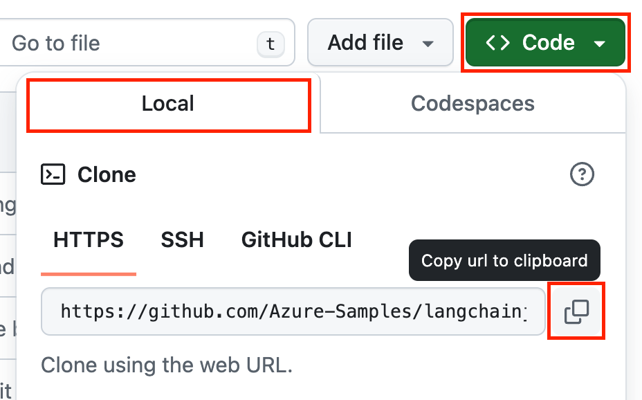

<!-- prettier-ignore -->

# Azure OpenAI keyless deployment

:star: If you like this sample, star it on GitHub — it helps a lot!

[Overview](#overview) • [Getting started](#getting-started) • [Run the sample](#run-the-sample) • [Resources](#resources) • [FAQ](#faq) • [Troubleshooting](#troubleshooting)

## Overview

This sample shows how to to provision an [Azure OpenAI](https://learn.microsoft.com/azure/ai-services/openai/overview) account with an [RBAC role](https://learn.microsoft.com/azure/role-based-access-control/built-in-roles) permission for your user account to access, so that you can use the OpenAI API SDKs with [keyless (Entra) authentication](https://learn.microsoft.com/entra/identity/managed-identities-azure-resources/overview).

## Getting started

There are multiple ways to get started with this project.

The quickest way is to use [GitHub Codespaces](#use-github-codespaces) that provides a preconfigured environment for you. Alternatively, you can [set up your local environment](#use-your-local-environment) following the instructions below.

### Use your local environment

You need to install following tools to work on your local machine:

- [Node.js LTS](https://nodejs.org/download/)
- [Azure Developer CLI](https://aka.ms/azure-dev/install)
- [Git](https://git-scm.com/downloads)
- [PowerShell 7+](https://github.com/powershell/powershell) _(for Windows users only)_
  - **Important**: Ensure you can run `pwsh.exe` from a PowerShell command. If this fails, you likely need to upgrade PowerShell.
  - Instead of Powershell, you can also use Git Bash or WSL to run the Azure Developer CLI commands.

Then you can get the project code:

1. [**Fork**](https://github.com/Azure-Samples/azure-openai-keyless-js/fork) the project to create your own copy of this repository.
2. On your forked repository, select the **Code** button, then the **Local** tab, and copy the URL of your forked repository.

  

3. Open a terminal and run this command to clone the repo: <code> git clone &lt;your-repo-url&gt; </code>

### Use GitHub Codespaces

You can run this project directly in your browser by using GitHub Codespaces, which will open a web-based VS Code:

### Use a VSCode dev container

A similar option to Codespaces is VS Code Dev Containers, that will open the project in your local VS Code instance using the [Dev Containers extension](https://marketplace.visualstudio.com/items?itemName=ms-vscode-remote.remote-containers).

You will also need to have [Docker](https://www.docker.com/products/docker-desktop) installed on your machine to run the container.

## Run the sample

### Azure prerequisites

- **Azure account**. If you're new to Azure, [get an Azure account for free](https://azure.microsoft.com/free) to get free Azure credits to get started. If you're a student, you can also get free credits with [Azure for Students](https://aka.ms/azureforstudents).
- **Azure subscription with access enabled for the Azure OpenAI service**. You can request access with [this form](https://aka.ms/oaiapply).
- **Azure account permissions**:
  - Your Azure account must have `Microsoft.Authorization/roleAssignments/write` permissions, such as [Role Based Access Control Administrator](https://learn.microsoft.com/azure/role-based-access-control/built-in-roles#role-based-access-control-administrator-preview), [User Access Administrator](https://learn.microsoft.com/azure/role-based-access-control/built-in-roles#user-access-administrator), or [Owner](https://learn.microsoft.com/azure/role-based-access-control/built-in-roles#owner). If you don't have subscription-level permissions, you must be granted [RBAC](https://learn.microsoft.com/azure/role-based-access-control/built-in-roles#role-based-access-control-administrator-preview) for an existing resource group and [deploy to that existing group](docs/deploy_existing.md#resource-group).
  - Your Azure account also needs `Microsoft.Resources/deployments/write` permissions on the subscription level.

### Cost estimation

Pricing varies per region and usage, so it isn't possible to predict exact costs for your usage.
However, you can use the [Azure pricing calculator](https://azure.com/e/43c784eb696e40fb9875c809da1c82cd) for the resources below to get an estimate.

- Azure OpenAI: Standard tier, GPT model. Pricing per 1K tokens used, and at least 1K tokens are used per question. [Pricing](https://azure.microsoft.com/pricing/details/cognitive-services/openai-service/)

### Provision Azure OpenAI resources

1. Open a terminal and navigate to the root of the project.
2. Authenticate with Azure by running `azd auth login`.
3. Run `azd provision` to provision the Azure resources.
   - You will be prompted to select a location for your OpenAI resource. If you're unsure of which location to choose, select `eastus2`. See [OpenAI model availability table](https://learn.microsoft.com/azure/ai-services/openai/concepts/models#standard-deployment-model-availability) for more information.

The deployment process will take a few minutes. Once it's done, a `.env` file will be created in the root folder with the environment variables needed to run the application.

### Run the JavaScript sample

First make sure you have provisioned the Azure OpenAI resources, and that you have the `.env` file in the root folder.

1. Run `npm install` to install the dependencies.
2. Run `npm start` to run the example.

This will use the [OpenAI SDK](https://github.com/openai/openai-node) to make a request to the OpenAI API and print the response to the console.

### Clean up

To clean up all the Azure resources created by this sample:

1. Run `azd down --purge`
2. When asked if you are sure you want to continue, enter `y`

The resource group and all the resources will be deleted.

## Resources

Here are some resources to learn more about Azure OpenAI and related technologies:

- [Serverless AI Chat sample](https://github.com/Azure-Samples/serverless-chat-langchainjs)
- [Generative AI For Beginners](https://github.com/microsoft/generative-ai-for-beginners)
- [Azure OpenAI Service](https://learn.microsoft.com/azure/ai-services/openai/overview)
- [Chat + Enterprise data with Azure OpenAI and Azure AI Search](https://github.com/Azure-Samples/azure-search-openai-javascript)

## Troubleshooting

If you have any issue when running or deploying this sample, please check the [troubleshooting guide](./docs/troubleshooting.md). If you can't find a solution to your problem, please [open an issue](https://github.com/Azure-Samples/azure-openai-keyless-js/issues) in this repository.

## Contributing

This project welcomes contributions and suggestions. Most contributions require you to agree to a
Contributor License Agreement (CLA) declaring that you have the right to, and actually do, grant us
the rights to use your contribution. For details, visit https://cla.opensource.microsoft.com.

When you submit a pull request, a CLA bot will automatically determine whether you need to provide
a CLA and decorate the PR appropriately (e.g., status check, comment). Simply follow the instructions
provided by the bot. You will only need to do this once across all repos using our CLA.

This project has adopted the [Microsoft Open Source Code of Conduct](https://opensource.microsoft.com/codeofconduct/).
For more information see the [Code of Conduct FAQ](https://opensource.microsoft.com/codeofconduct/faq/) or
contact [opencode@microsoft.com](mailto:opencode@microsoft.com) with any additional questions or comments.

## Trademarks

This project may contain trademarks or logos for projects, products, or services. Authorized use of Microsoft
trademarks or logos is subject to and must follow
[Microsoft's Trademark & Brand Guidelines](https://www.microsoft.com/en-us/legal/intellectualproperty/trademarks/usage/general).
Use of Microsoft trademarks or logos in modified versions of this project must not cause confusion or imply Microsoft sponsorship.
Any use of third-party trademarks or logos are subject to those third-party's policies.
