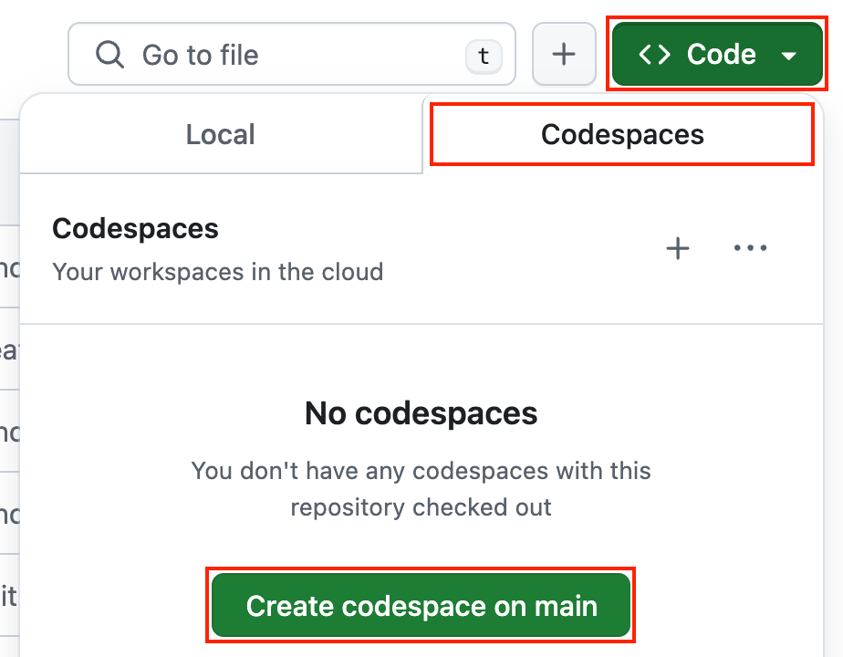

<!-- Learn samples onboarding: https://review.learn.microsoft.com/en-us/help/contribute/samples/process/onboarding?branch=main -->
<!-- prettier-ignore -->
This sample shows how to to provision an [Azure OpenAI](https://learn.microsoft.com/azure/ai-services/openai/overview) account with an [RBAC role](https://learn.microsoft.com/azure/role-based-access-control/built-in-roles) permission for your user account to access, so that you can use the OpenAI API SDKs with [keyless (Entra) authentication](https://learn.microsoft.com/entra/identity/managed-identities-azure-resources/overview).

## Prerequisites

- [Node.js LTS](https://nodejs.org/download/)
- [Azure Developer CLI](https://aka.ms/azure-dev/install)
- [Git](https://git-scm.com/downloads)
- [PowerShell 7+](https://github.com/powershell/powershell) _(for Windows users only)_
  - **Important**: Ensure you can run `pwsh.exe` from a PowerShell command. If this fails, you likely need to upgrade PowerShell.
  - Instead of Powershell, you can also use Git Bash or WSL to run the Azure Developer CLI commands.
- Azure account. If you're new to Azure, [get an Azure account for free](https://azure.microsoft.com/free) to get free Azure credits to get started. If you're a student, you can also get free credits with [Azure for Students](https://aka.ms/azureforstudents).
- Azure subscription with access enabled for the Azure OpenAI service. You can request access with [this form](https://aka.ms/oaiapply).
- Azure account permissions:
  - Your Azure account must have `Microsoft.Authorization/roleAssignments/write` permissions, such as [Role Based Access Control Administrator](https://learn.microsoft.com/azure/role-based-access-control/built-in-roles#role-based-access-control-administrator-preview), [User Access Administrator](https://learn.microsoft.com/azure/role-based-access-control/built-in-roles#user-access-administrator), or [Owner](https://learn.microsoft.com/azure/role-based-access-control/built-in-roles#owner). If you don't have subscription-level permissions, you must be granted [RBAC](https://learn.microsoft.com/azure/role-based-access-control/built-in-roles#role-based-access-control-administrator-preview) for an existing resource group and deploy to that existing group by running these commands:
    ```bash
    azd env set AZURE_RESOURCE_GROUP <name of existing resource group>
    azd env set AZURE_LOCATION <location of existing resource group>
    ```
  - Your Azure account also needs `Microsoft.Resources/deployments/write` permissions on the subscription level.

## Setup the sample

You can run this project directly in your browser by using GitHub Codespaces, which will open a web-based VS Code.

1. [**Fork**](https://github.com/Azure-Samples/azure-openai-keyless-js/fork) the project to create your own copy of this repository.
2. On your forked repository, select the **Code** button, then the **Codespaces** tab, and clink on the button **Create codespace on main**.
   
3. Wait for the Codespace to be created, it should take a few minutes.

## Provision Azure OpenAI resources

1. Open a terminal and navigate to the root of the project.
2. Authenticate with Azure by running `azd auth login`.
3. Run `azd provision` to provision the Azure resources.
   - You will be prompted to select a location for your OpenAI resource. If you're unsure of which location to choose, select `eastus2`. See [OpenAI model availability table](https://learn.microsoft.com/azure/ai-services/openai/concepts/models#standard-deployment-model-availability) for more information.

The deployment process will take a few minutes. Once it's done, a `.env` file will be created in the root folder with the environment variables needed to run the application.

## Run the sample

First make sure you have provisioned the Azure OpenAI resources, and that you have the `.env` file in the root folder.

1. Run `npm install` to install the dependencies.
2. Run `npm start` to run the example.

This will use the [OpenAI SDK](https://github.com/openai/openai-node) to make a request to the OpenAI API and print the response to the console.

## Clean up

To clean up all the Azure resources created by this sample:

1. Run `azd down --purge`
2. When asked if you are sure you want to continue, enter `y`

The resource group and all the resources will be deleted.

## Troubleshooting

If you have any issue when running or deploying this sample, please check the [troubleshooting guide](./troubleshooting.md). If you can't find a solution to your problem, please [open an issue](https://github.com/Azure-Samples/azure-openai-keyless-js/issues) in this repository.

### Security

This sample has [Managed Identity](https://learn.microsoft.com/entra/identity/managed-identities-azure-resources/overview) built in to eliminate the need for developers to manage these credentials. Applications can use managed identities to obtain Microsoft Entra tokens without having to handle any secrets in the code. Additionally, we're using [Microsoft Security DevOps GitHub Action](https://github.com/microsoft/security-devops-action) to scan the infrastructure-as-code files and generates a report containing any detected issues.

You can Learn more about using Managed Identity with Azure OpenAI in this [tutorial](https://learn.microsoft.com/training/modules/intro-azure-openai-managed-identity-auth-javascript/).

## Next steps

Here are some resources to learn more about the technologies used in this sample:

- [OpenAI Node.js SDK](https://github.com/openai/openai-node)
- [Serverless AI Chat sample](https://github.com/Azure-Samples/serverless-chat-langchainjs)
- [Generative AI with JavaScript](https://github.com/microsoft/generative-ai-with-javascript)
- [Generative AI For Beginners](https://github.com/microsoft/generative-ai-for-beginners)
- [Azure OpenAI Service](https://learn.microsoft.com/azure/ai-services/openai/overview)
- [Chat + Enterprise data with Azure OpenAI and Azure AI Search](https://github.com/Azure-Samples/azure-search-openai-javascript)

You can also find [more Azure AI samples here](https://github.com/Azure-Samples/azureai-samples).
